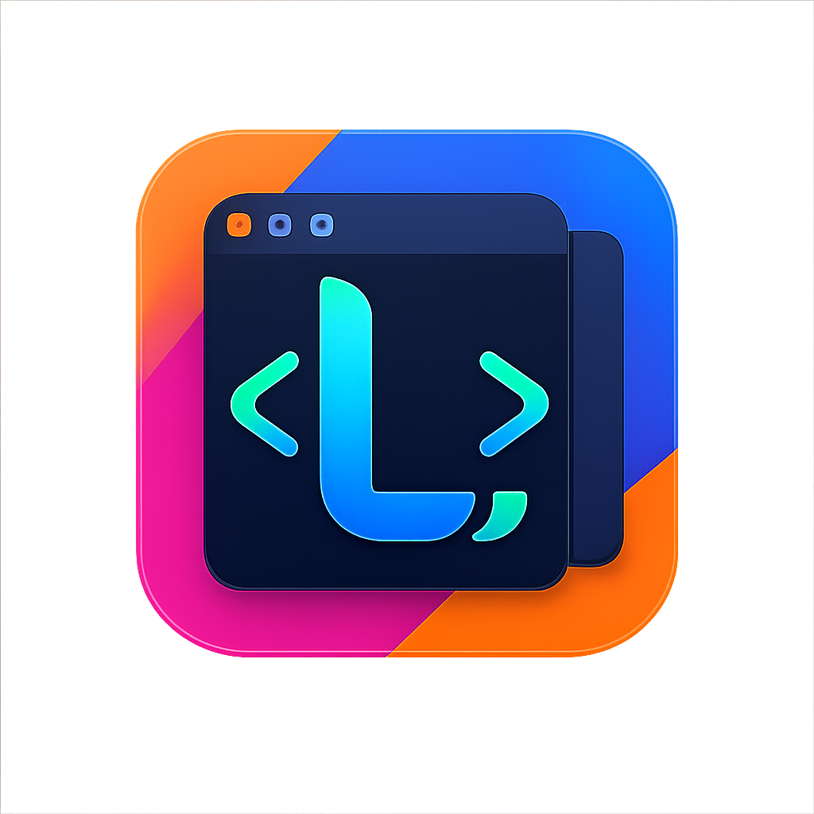
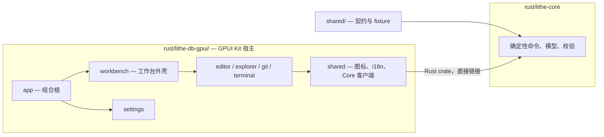

<div align="center">
  

  <h1>Lithe</h1>

  <p><strong>面向 Java 开发与 AI 协作的低内存占用 IntelliJ IDEA 替代品</strong></p>

  <p>
    <a href="./README.md"><strong>English</strong></a> ·
    <a href="#核心功能">核心功能</a> ·
    <a href="#产品截图">产品截图</a> ·
    <a href="#下载与安装">下载</a> ·
    <a href="https://1lck.github.io/Lithe-IDEA/">工程决策看板</a> ·
    <a href="#如何开发">如何开发</a>
  </p>

  <p>
    <a href="https://hellogithub.com/repository/1lck/Lithe-IDEA" target="_blank"></a>
    <a href="https://atomgit.com/lithe_IDEA/Lithe-IDEA"></a>
  </p>

  <p>
    <a href="https://github.com/1lck/Lithe-IDEA/releases/latest"></a>
    <a href="https://github.com/1lck/Lithe-IDEA/releases"></a>
    
    
    <a href="./LICENSE"></a>
  </p>
</div>

## 欢迎加入群聊

欢迎加入 Lithe 社区，分享使用体验、交流问题，并获取项目最新动态。

<div align="center">
<table>
  <tr>
    <th>QQ群</th>
    <th>微信群</th>
  </tr>
  <tr>
    <td align="center"><a href="https://qm.qq.com/cgi-bin/qm/qr?k=&amp;group_code=163027877"></a></td>
    <td align="center"><a href="https://gcnctzuuwe9u.feishu.cn/wiki/HJFbwZ0hZirAPnkWF3xcPWkCnid?from=from_copylink"></a></td>
  </tr>
</table>
</div>

如果无法扫描微信群二维码，[点击这里通过飞书加入群聊](https://gcnctzuuwe9u.feishu.cn/wiki/HJFbwZ0hZirAPnkWF3xcPWkCnid?from=from_copylink)。

## 为什么做 Lithe

Codex、Claude Code 等 AI 编程工具已经可以承担大量编码工作，但开发者仍然需要 IDE 来理解生成的代码、跳转符号、运行调试项目并审查每一次修改。只为完成这些工作而常驻一套占用数 GB 内存的开发环境，显得越来越沉重。

## Lithe 是什么

Lithe 是一款主要面向 Java 和 Spring Boot 开发者的轻量级 IDEA 替代品，保留项目浏览、代码编辑与导航、搜索、Maven、运行调试、Git Diff、本地历史和数据库等核心工作流。

打开普通项目后，Lithe 应用本身的基础内存占用通常约为 **300～400 MB**。语言服务器、终端、构建工具、调试器和数据库组件均按需启动；实际占用会随项目和启用的服务变化。

> **AI 负责编写代码，Lithe 负责帮你看懂、跑通并审查修改。**

## 仓库现状

macOS（SwiftUI/AppKit）与 Windows（React/Tauri 2）两套前端已从本仓库移除，
接替它们的是 `rust/lithe-db-gpui/` 里唯一的 GPUI Kit 宿主，目前仍在开发中，尚未建立发布流水线。
[GitHub Releases](https://github.com/1lck/Lithe-IDEA/releases) 上的安装包来自
已删除的源码，仅作历史留存。

如果你安装的是此前发布的 macOS 版本并被 Gatekeeper 阻止，处理方式不变：在
“应用程序”中按住 Control 键点按应用，或在终端执行
`sudo xattr -dr com.apple.quarantine /Applications/Lithe.app`。上述命令只应对
你确认来源可靠的应用使用。

## 核心功能

<details>
<summary>展开核心功能</summary>

1. 适配 Spring Boot 项目体系，适合 Java 开发。
2. 支持 Maven 管理、断点调试和自定义启动配置。
3. 支持 Git 管理和 Diff 审查。
4. 支持双击 Shift 搜索，以及 `Command + Shift + F` 全局搜索。
5. 支持无需 LSP 的轻量补全和当前文件导航，并可按需使用语言服务器增强补全、悬浮与语义导航。
6. 支持本地快照保存。
7. 支持在应用内打开多个项目。
8. 支持在同一窗口打开多个文件，各文件相互独立。
9. 支持使用 AI 自动生成 Commit Message，并可自定义格式。
10. 支持多种 Markdown 语法渲染，与语雀一致。
11. 支持查看应用的本地内存占用情况。
12. 支持通过 Homebrew 一键安装和更新。
13. 支持在应用内一键更新并安装。
14. 自动识别 Spring Boot、Java、Maven、Gradle、npm、Cargo、Go、Python、Make、Docker Compose、Procfile 和 Shell 项目的可运行入口，并支持一键运行。
15. 支持按语言独立开关语言服务，可根据电脑配置自由启用或停用。
16. 支持类似 IDEA 的多行编辑器标签，同时展示更多打开的文件。
17. 新增数据库连接工作台，支持多种数据库类型、连接管理、SQL 历史、表浏览和数据库操作。
18. 持续修复问题并优化用户体验。

</details>

## 产品截图

<p align="center">
  
  
</p>

<p align="center">
  
</p>

<p align="center">
  
  
</p>

<p align="center">
  
</p>

<p align="center">
  
  
</p>

<p align="center">
  
  
</p>

<p align="center">
  
</p>

<p align="center">
  
  
</p>

<p align="center">
  
  
</p>

## 下载与安装

**目前没有可下载的构建产物。** 原 macOS 与 Windows 产品已从本仓库移除，接替它们的
GPUI 宿主还没有打包与发布流水线。[GitHub Releases](https://github.com/1lck/Lithe-IDEA/releases)
上仍然能下载到旧安装包，但它们是用已删除的源码构建的。

## 架构概览

Lithe 现在是一个纯 Rust 仓库，只有一个宿主：`rust/lithe-db-gpui/` 里的 GPUI Kit 应用，
它驱动 `rust/lithe-core` 的确定性命令面。



gpui 各 crate 的依赖严格向下：`app -> workbench -> {editor, explorer, git,
terminal} -> shared`，以及 `app -> settings -> shared`。`rust/lithe-core`
不依赖 GPUI，也不依赖任何界面框架。

<details>
<summary><strong>开发 Lithe</strong></summary>


在仓库根目录构建并运行宿主：

```bash
cargo build --bin Lithe
./rust/target/debug/Lithe <workspace-root>
```

`--theme`、`--locale`、`--open-settings` 只对这一次启动生效，不会写回设置。
测试时用 `LITHE_GPUI_SETTINGS_FILE` 把设置文件指向临时路径。

提交改动前请运行：

```bash
cargo fmt --manifest-path rust/Cargo.toml -p lithe-core -- --check
cargo test --manifest-path rust/Cargo.toml -p lithe-core
cargo test --manifest-path rust/Cargo.toml -p lithe-db-gpui-app
./scripts/verify-rust-core.sh
./scripts/verify-shared-contracts.sh
node scripts/verify-agent-notes.mjs
node scripts/test-classify-ci-changes.mjs
```

gpui 宿主目前还没有 CI lane，上面这些检查就是门槛。目录所有权与 Rust Core
注释规范见
[仓库所有权与共享边界](./.agents/notes/implemented/architecture/2026-09-13-repository-ownership-and-sharing-boundaries.md)。
提交时请写清验证步骤与已知限制。

</details>

## 项目支持

### ❤️ 赞助商

<p align="center">
  <a href="https://www.fastaitoken.com/">
    
  </a>
</p>
<p align="center">
  <a href="https://www.fastaitoken.com/"><strong>FastAI</strong></a><br>
  FastAI 提供多款主流大模型的便捷中转服务，让开发者可以更轻松地把 AI 能力接入日常开发流程。其支持也帮助 Lithe 持续完善 AI 辅助体验。感谢 FastAI 对本项目的支持！欢迎扫码加入 FastAI Token 交流群②（群号：1073874006）。
</p>

<a href="mailto:2188718831@qq.com">想显示在下方？</a>

<table>
  <tr>
    <td width="112" align="center">
      <a href="https://www.fastaitoken.com/">
        
      </a>
    </td>
    <td>
      <a href="https://www.fastaitoken.com/"><strong>FastAI</strong></a> 提供多款主流大模型的便捷中转服务，让开发者可以更轻松地把 AI 能力接入日常开发流程。其支持也帮助 Lithe 持续完善 AI 辅助体验。感谢 FastAI 对本项目的支持！
    </td>
  </tr>
  <tr>
    <td width="112" align="center">
      <a href="https://torchai.ai/sign-up?aff=FdkE">
        
      </a>
    </td>
    <td>
      <a href="https://torchai.ai/sign-up?aff=FdkE"><strong>TorchAI</strong></a> 面向开发者提供大模型中转服务，便于在编程、内容生成和自动化等不同场景中调用模型 API。其支持帮助 Lithe 保持持续开发，并探索更实用的 AI 工具体验。感谢 TorchAI 对本项目的支持！
    </td>
  </tr>
  <tr>
    <td width="112" align="center">
      <a href="https://www.atlascloud.ai/zh">
        
      </a>
    </td>
    <td>
      <a href="https://www.atlascloud.ai/zh"><strong>Atlas Cloud</strong></a> 是一家提供 <strong>400 多种模型</strong>的 AI 中转服务平台，丰富的模型选择是它的一大特色。开发者可以在同一平台探索和比较不同模型，为自己的应用选择更合适的 AI 能力。感谢 Atlas Cloud 对 Lithe 的赞助，支持项目持续完善 AI 辅助开发体验！
    </td>
  </tr>
  <tr>
    <td width="112" align="center">
      <a href="https://codezsy.com/register?aff=fDyA">
        
      </a>
    </td>
    <td>
      <a href="https://codezsy.com/register?aff=fDyA"><strong>CodeZ</strong></a> 专注于 GPT 系列模型的稳定中转，为开发者在工具和项目中集成模型 API 提供简单直接的选择。其赞助为 Lithe 的持续开发与维护提供了助力。感谢 CodeZ 对本项目的支持！
    </td>
  </tr>
  <tr>
    <td width="112" align="center">
      <a href="https://app.rainyun.com/apps/rcs/392785/detail?view=info">
        
      </a>
    </td>
    <td>
      <a href="https://app.rainyun.com/apps/rcs/392785/detail?view=info"><strong>雨云</strong></a> 提供云服务器等云计算服务，为应用部署、网站搭建和开发测试提供灵活的云端环境。感谢雨云对 Lithe 的支持，助力项目持续开发与完善！
    </td>
  </tr>
</table>

### ⭐ 特别鸣谢

<p align="center">
  <a href="https://linux.do/">
    
  </a>
</p>

<p align="center">
  <strong>关于 AI 的一切，欢迎前往 <a href="https://linux.do/">LINUX DO</a>！祝社区越来越好～</strong>
</p>

### 贡献者

感谢所有参与 Lithe 开发和改进的贡献者。

<a href="https://github.com/1lck/Lithe-IDEA/graphs/contributors">
  
</a>

### License

Lithe 采用 [Apache License 2.0](./LICENSE) 授权。

## Star History

<a href="https://www.star-history.com/#1lck/Lithe-IDEA&Date">
  
</a>
